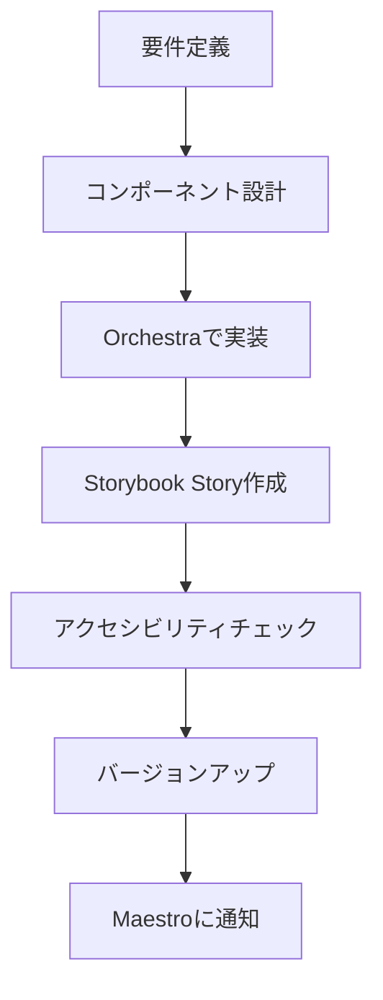
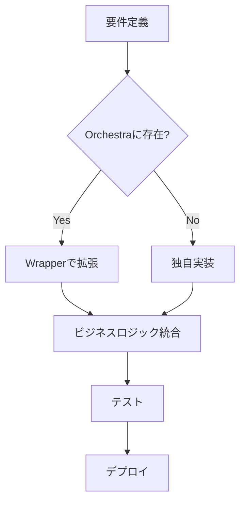

# Orchestra-Maestro 親子テーマアーキテクチャ設計書

**作成日**: 2025-10-09
**最終更新**: 2025-10-09
**バージョン**: 1.0
**ステータス**: 設計中

---

## 目次

1. [システム概要](#1-システム概要)
2. [アーキテクチャ原則](#2-アーキテクチャ原則)
3. [ディレクトリ構造](#3-ディレクトリ構造)
4. [コンポーネント継承モデル](#4-コンポーネント継承モデル)
5. [パス解決とエイリアス](#5-パス解決とエイリアス)
6. [開発ワークフロー](#6-開発ワークフロー)
7. [バージョン管理戦略](#7-バージョン管理戦略)
8. [実装パターン](#8-実装パターン)
9. [ビルド・デプロイ](#9-ビルドデプロイ)
10. [トラブルシューティング](#10-トラブルシューティング)

---

## 1. システム概要

### 1.1 アーキテクチャコンセプト

**Orchestra**（親テーマ）と**Maestro**（子テーマ）の関係性は、WordPressの親テーマ・子テーマモデルを参考にした継承アーキテクチャです。

```
┌─────────────────────────────────────────────────┐
│  Orchestra (親テーマ)                            │
│  - デザインシステム                               │
│  - 基本コンポーネント（Atoms/Molecules/Organisms）│
│  - Storybook環境                                 │
└─────────────────┬───────────────────────────────┘
                  │ 継承・拡張
                  ▼
┌─────────────────────────────────────────────────┐
│  Maestro (子テーマ)                              │
│  - ECサイト実装                                  │
│  - Orchestraコンポーネントをラップ・拡張         │
│  - ビジネスロジック統合                          │
└─────────────────────────────────────────────────┘
```

### 1.2 設計目標

| 目標 | 説明 |
|------|------|
| **保守性** | Orchestraの更新がMaestroに容易に反映できる |
| **拡張性** | Maestroが独自機能を追加しやすい |
| **分離性** | 親・子の責務が明確に分離されている |
| **再利用性** | Orchestraコンポーネントが他プロジェクトでも利用可能 |
| **型安全性** | TypeScriptによる型整合性の保証 |

---

## 2. アーキテクチャ原則

### 2.1 責務分離（Separation of Concerns）

#### Orchestra（親テーマ）の責務
- ✅ UIコンポーネントの提供（Atoms/Molecules/Organisms）
- ✅ デザイントークンの定義（色、タイポグラフィ、スペーシング）
- ✅ アクセシビリティ対応
- ✅ Storybookドキュメント
- ❌ ビジネスロジックは含まない
- ❌ API通信は含まない
- ❌ 状態管理（Zustand Store）は含まない

#### Maestro（子テーマ）の責務
- ✅ Orchestraコンポーネントの利用・拡張
- ✅ ビジネスロジック実装
- ✅ API統合
- ✅ 状態管理（Zustand）
- ✅ ページ実装（Next.js Pages/App Router）
- ✅ 独自コンポーネントの追加

### 2.2 継承の優先順位

```
1. Maestro独自コンポーネント（最優先）
   ↓
2. MaestroによるOrchestraラッパー
   ↓
3. Orchestra親コンポーネント（フォールバック）
```

### 2.3 破壊的変更の防止

- Orchestraのpublicインターフェース（Props）は**semverに準拠**
- Breaking Changesはメジャーバージョンアップ時のみ
- 非推奨（deprecated）プロパティは1バージョン猶予期間を設ける

---

## 3. ディレクトリ構造

### 3.1 全体構造

```
ec_Design/
│
├── storybook/                          # Orchestra（親テーマ）
│   ├── .storybook/                     # Storybook設定
│   ├── stories/                        # Stories
│   │   ├── atoms/
│   │   ├── molecules/
│   │   ├── organisms/
│   │   └── templates/
│   ├── src/                            # Orchestraコンポーネント実装
│   │   └── components/
│   │       ├── ui/                     # Atoms
│   │       │   ├── Button.tsx
│   │       │   ├── Input.tsx
│   │       │   └── Badge.tsx
│   │       ├── common/                 # Molecules
│   │       │   ├── Breadcrumb.tsx
│   │       │   └── Pagination.tsx
│   │       └── product/                # Organisms
│   │           └── ProductCard.tsx
│   ├── package.json
│   └── tsconfig.json
│
└── smartsample-nextjs/                 # Maestro（子テーマ）
    ├── orchestra -> ../storybook/src   # シンボリックリンク（推奨）
    │
    ├── src/
    │   ├── components/
    │   │   ├── ui/                     # Atoms Wrapper
    │   │   │   ├── Button.tsx          # ラップ: @orchestra/components/ui/Button
    │   │   │   ├── Input.tsx           # ラップ: @orchestra/components/ui/Input
    │   │   │   └── CustomToggle.tsx    # 独自: Maestro専用コンポーネント
    │   │   │
    │   │   ├── common/                 # Molecules Wrapper
    │   │   ├── product/                # Organisms Wrapper
    │   │   ├── cart/                   # Maestro独自（Orchestraに存在しない）
    │   │   ├── checkout/               # Maestro独自
    │   │   └── layout/                 # Maestro独自
    │   │
    │   ├── app/                        # Next.js App Router
    │   ├── store/                      # Zustand Store（Maestro独自）
    │   └── lib/                        # ユーティリティ
    │
    ├── package.json
    └── tsconfig.json
```

### 3.2 Orchestraディレクトリの参照方法

#### オプション1: シンボリックリンク（推奨）

```bash
cd smartsample-nextjs
ln -s ../storybook/src orchestra
```

**メリット**:
- リアルタイム同期
- ディスク容量節約
- Orchestraの変更が即座に反映

**デメリット**:
- Windows環境での互換性問題（要管理者権限）

#### オプション2: Git Submodule

```bash
cd smartsample-nextjs
git submodule add ../storybook orchestra
```

**メリット**:
- バージョン固定可能
- クロスプラットフォーム対応

**デメリット**:
- 更新に`git submodule update`が必要

#### オプション3: npm workspaces（将来）

```json
// ルートのpackage.json
{
  "workspaces": [
    "storybook",
    "smartsample-nextjs"
  ]
}
```

---

## 4. コンポーネント継承モデル

### 4.1 継承パターン一覧

| パターン | 説明 | 使用ケース | 例 |
|---------|------|-----------|-----|
| **完全継承** | Orchestraをそのまま使用 | 変更不要のコンポーネント | Badge, Divider |
| **Wrapper拡張** | Orchestraをラップして機能追加 | アナリティクス、追加スタイル | Button, Input |
| **部分上書き** | Propsの一部を変更 | デフォルト値の変更 | Select |
| **完全独自** | Maestro独自実装 | Orchestraに存在しない | CartItem, CheckoutForm |

### 4.2 パターン別実装例

#### パターン1: 完全継承（Re-export）

```tsx
// Maestro: src/components/ui/Badge.tsx
export { default } from '@orchestra/components/ui/Badge';
export type { BadgeProps } from '@orchestra/components/ui/Badge';
```

**適用基準**:
- Orchestraのコンポーネントで十分
- カスタマイズ不要
- 将来的にも変更予定なし

---

#### パターン2: Wrapper拡張

```tsx
// Maestro: src/components/ui/Button.tsx
import OrchestraButton, { ButtonProps as OrchestraButtonProps } from '@orchestra/components/ui/Button';
import { trackEvent } from '@/lib/analytics';

// Maestro独自プロパティを追加
export interface ButtonProps extends OrchestraButtonProps {
  analytics?: {
    category: string;
    action: string;
    label?: string;
  };
  dataTestId?: string; // テスト用ID
}

export default function Button({
  analytics,
  dataTestId,
  onClick,
  ...orchestraProps
}: ButtonProps) {
  const handleClick = (e: React.MouseEvent) => {
    // Maestro独自: アナリティクス送信
    if (analytics) {
      trackEvent(analytics.category, analytics.action, analytics.label);
    }

    // 親のonClickを実行
    onClick?.(e);
  };

  return (
    <OrchestraButton
      {...orchestraProps}
      onClick={handleClick}
      data-testid={dataTestId}
    />
  );
}
```

**適用基準**:
- Orchestraの機能をベースに拡張したい
- アナリティクス、テスト属性などの追加機能
- 親の実装を変更せず機能追加

---

#### パターン3: 部分上書き

```tsx
// Maestro: src/components/ui/Select.tsx
import OrchestraSelect, { SelectProps as OrchestraSelectProps } from '@orchestra/components/ui/Select';

export interface SelectProps extends Omit<OrchestraSelectProps, 'variant'> {
  variant?: 'default' | 'maestro-custom'; // Maestro独自variantを追加
}

export default function Select({ variant = 'default', ...props }: SelectProps) {
  // Maestro独自のvariantロジック
  const customClassName = variant === 'maestro-custom'
    ? 'maestro-select-custom'
    : '';

  return (
    <OrchestraSelect
      {...props}
      className={`${props.className || ''} ${customClassName}`}
    />
  );
}
```

**適用基準**:
- Orchestraの一部プロパティを変更
- デフォルト値の変更
- Maestro独自バリアントの追加

---

#### パターン4: 完全独自実装

```tsx
// Maestro: src/components/cart/CartItem.tsx
import { useCartStore } from '@/store/useCartStore';
import Button from '@/components/ui/Button';
import QuantitySelector from '@/components/product/QuantitySelector';

export interface CartItemProps {
  id: string;
  name: string;
  price: number;
  quantity: number;
  imageUrl: string;
}

export default function CartItem({ id, name, price, quantity, imageUrl }: CartItemProps) {
  const { updateQuantity, removeItem } = useCartStore();

  return (
    <div className="cart-item">
      
      <h3>{name}</h3>
      <p>{price}円</p>
      <QuantitySelector
        value={quantity}
        onChange={(qty) => updateQuantity(id, qty)}
      />
      <Button variant="outline" onClick={() => removeItem(id)}>
        削除
      </Button>
    </div>
  );
}
```

**適用基準**:
- Orchestraに存在しないコンポーネント
- ビジネスロジックを含む
- Zustand Storeと連携

---

## 5. パス解決とエイリアス

### 5.1 TypeScript設定

```json
// smartsample-nextjs/tsconfig.json
{
  "compilerOptions": {
    "baseUrl": ".",
    "paths": {
      "@/*": ["./src/*"],
      "@orchestra/*": ["./orchestra/*"]
    }
  }
}
```

### 5.2 Next.js設定

```js
// smartsample-nextjs/next.config.js
const path = require('path');

module.exports = {
  webpack: (config) => {
    config.resolve.alias['@orchestra'] = path.resolve(__dirname, 'orchestra');
    return config;
  },
};
```

### 5.3 Storybook設定（Orchestra側）

```js
// storybook/.storybook/main.ts
import path from 'path';

const config = {
  webpackFinal: async (config) => {
    config.resolve.alias = {
      ...config.resolve.alias,
      '@/components': path.resolve(__dirname, '../src/components'),
    };
    return config;
  },
};
```

---

## 6. 開発ワークフロー

### 6.1 Orchestra開発フロー



### 6.2 Maestro開発フロー



### 6.3 Orchestra更新時のMaestro対応フロー

```bash
# 1. Orchestraのバージョン確認
cd storybook
git pull origin main
npm version  # 例: 1.2.0

# 2. Maestro側で更新を取り込む
cd ../smartsample-nextjs
git pull origin main  # submoduleの場合
# または
# シンボリックリンクの場合は自動的に反映される

# 3. Breaking Changesがないか確認
npm run type-check

# 4. テスト実行
npm run test
npm run e2e

# 5. 問題なければコミット
git add .
git commit -m "chore: update Orchestra to v1.2.0"
```

---

## 7. バージョン管理戦略

### 7.1 Semantic Versioning

Orchestra は **semver（セマンティックバージョニング）** に準拠：

```
MAJOR.MINOR.PATCH

例: 1.2.3
  │  │  └─ PATCH: バグフィックス（後方互換性あり）
  │  └──── MINOR: 機能追加（後方互換性あり）
  └─────── MAJOR: 破壊的変更（後方互換性なし）
```

### 7.2 互換性マトリクス

| Orchestra | Maestro | 互換性 | 備考 |
|-----------|---------|-------|------|
| 1.x.x | 1.0.0+ | ✅ | 完全互換 |
| 2.0.0 | 1.x.x | ⚠️ | 移行ガイド参照 |
| 2.1.0 | 2.0.0+ | ✅ | 新機能追加 |

### 7.3 Breaking Changes通知

Orchestra でBreaking Changesが発生した場合：

1. **CHANGELOG.md** に明記
2. **マイグレーションガイド** 作成
3. Maestro開発者に通知（Slack/Email）
4. 猶予期間を設ける（最低2週間）

---

## 8. 実装パターン

### 8.1 Propsの拡張

```tsx
// Orchestra: ButtonProps
interface ButtonProps {
  variant: 'primary' | 'secondary';
  size: 'sm' | 'md' | 'lg';
}

// Maestro: 拡張
interface MaestroButtonProps extends ButtonProps {
  analytics?: AnalyticsConfig; // 追加
  theme?: 'light' | 'dark';     // 追加
}
```

### 8.2 デフォルト値の上書き

```tsx
// Orchestra: デフォルトsize = 'md'
export default function Button({ size = 'md', ...props }) { ... }

// Maestro: デフォルトsize = 'lg'に変更
export default function Button({ size = 'lg', ...props }) {
  return <OrchestraButton size={size} {...props} />;
}
```

### 8.3 スタイルの拡張

```tsx
// Maestro
export default function Button({ className, ...props }: ButtonProps) {
  return (
    <OrchestraButton
      {...props}
      className={`${className || ''} maestro-button-extension`}
    />
  );
}
```

```css
/* Maestro: globals.css */
.maestro-button-extension {
  box-shadow: 0 4px 6px rgba(0, 0, 0, 0.1);
  transition: transform 0.2s;
}

.maestro-button-extension:hover {
  transform: translateY(-2px);
}
```

---

## 9. ビルド・デプロイ

### 9.1 ビルドプロセス

```bash
# Orchestra（Storybook）
cd storybook
npm run build-storybook
# 出力: storybook-static/

# Maestro（Next.js）
cd smartsample-nextjs
npm run build
# 出力: .next/
```

### 9.2 CI/CD統合

```yaml
# .github/workflows/deploy-maestro.yml
name: Deploy Maestro

on:
  push:
    branches: [main]

jobs:
  deploy:
    runs-on: ubuntu-latest
    steps:
      - uses: actions/checkout@v3
        with:
          submodules: true  # Orchestra submodule取得

      - name: Setup Node.js
        uses: actions/setup-node@v3
        with:
          node-version: '20'

      - name: Install dependencies
        run: |
          cd smartsample-nextjs
          npm ci

      - name: Type check
        run: npm run type-check

      - name: Build
        run: npm run build

      - name: Deploy
        run: npm run deploy
```

---

## 10. トラブルシューティング

### 10.1 よくある問題

#### 問題1: `Cannot find module '@orchestra/components/ui/Button'`

**原因**: シンボリックリンクまたはパスエイリアスが正しく設定されていない

**解決策**:
```bash
# シンボリックリンクの確認
ls -la smartsample-nextjs/orchestra

# 再作成
rm smartsample-nextjs/orchestra
ln -s ../storybook/src smartsample-nextjs/orchestra
```

#### 問題2: TypeScript型エラー

**原因**: Orchestra と Maestro の型定義が不一致

**解決策**:
```bash
# TypeScript型チェック
npm run type-check

# 型定義の再生成
cd storybook && npm run build
cd ../smartsample-nextjs && npm run type-check
```

#### 問題3: Breaking Changesによるビルドエラー

**原因**: Orchestra メジャーバージョンアップ

**解決策**:
1. `CHANGELOG.md` を確認
2. マイグレーションガイドに従って修正
3. 型エラーを順次解決

---

## 11. ベストプラクティス

### 11.1 DO（推奨）

✅ OrchestraコンポーネントはWrapperで拡張
✅ Propsは`extends`で継承
✅ 型定義を必ず export
✅ Breaking Changesは CHANGELOG に明記
✅ semverに厳密に従う

### 11.2 DON'T（非推奨）

❌ Orchestraコンポーネントを直接編集（Maestro内で）
❌ Propsの型を完全に再定義（継承を使う）
❌ Breaking Changesを事前通知なしにリリース
❌ 循環依存の作成
❌ ビジネスロジックをOrchestraに混入

---

## 12. 今後の拡張計画

- [ ] Orchestraのnpmパッケージ化
- [ ] 自動同期CLIツールの開発
- [ ] Chromatic統合（ビジュアルリグレッションテスト）
- [ ] ダークモード対応
- [ ] Maestro独自テーマシステム

---

## 変更履歴

| 日付 | バージョン | 変更内容 | 変更者 |
|------|-----------|---------|--------|
| 2025-10-09 | 1.0 | 初版作成 | プロジェクトチーム |

---

**管理者**: プロジェクトチーム
**最終更新**: 2025-10-09
