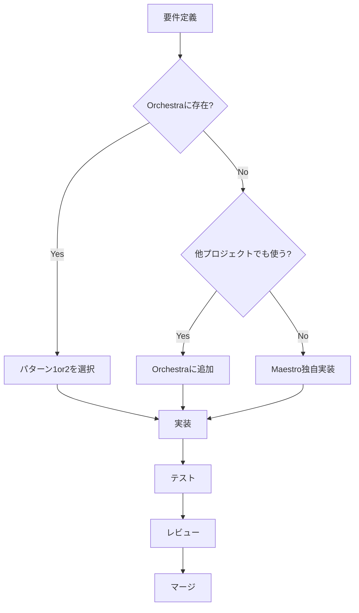

# Orchestra-Maestro 実装ガイドライン

**作成日**: 2025-10-09
**最終更新**: 2025-10-09
**バージョン**: 1.0
**対象**: 開発者

---

## 目次

1. [セットアップ手順](#1-セットアップ手順)
2. [コンポーネント実装パターン](#2-コンポーネント実装パターン)
3. [開発ワークフロー](#3-開発ワークフロー)
4. [命名規則](#4-命名規則)
5. [テスト戦略](#5-テスト戦略)
6. [よくある質問](#6-よくある質問)

---

## 1. セットアップ手順

### 1.1 初期セットアップ

#### Step 1: Orchestra参照の設定

**オプションA: シンボリックリンク（推奨・Mac/Linux）**

```bash
cd smartsample-nextjs
ln -s ../storybook/src orchestra
```

**オプションB: Git Submodule（Windows推奨）**

```bash
cd smartsample-nextjs
git submodule add ../storybook orchestra
git submodule update --init --recursive
```

#### Step 2: TypeScript設定

```json
// smartsample-nextjs/tsconfig.json
{
  "compilerOptions": {
    "baseUrl": ".",
    "paths": {
      "@/*": ["./src/*"],
      "@orchestra/*": ["./orchestra/*"]
    }
  }
}
```

#### Step 3: Next.js Webpack設定

```js
// smartsample-nextjs/next.config.js
const path = require('path');

module.exports = {
  webpack: (config) => {
    config.resolve.alias = {
      ...config.resolve.alias,
      '@orchestra': path.resolve(__dirname, 'orchestra'),
    };
    return config;
  },
};
```

#### Step 4: 動作確認

```bash
cd smartsample-nextjs
npm run dev
```

ブラウザで http://localhost:3000 にアクセスし、エラーがないことを確認。

---

## 2. コンポーネント実装パターン

### 2.1 決定フローチャート

```
新しいコンポーネントが必要？
  │
  ├─ YES → Orchestraに存在する？
  │         │
  │         ├─ YES → カスタマイズ必要？
  │         │         │
  │         │         ├─ YES → パターン2: Wrapper拡張
  │         │         └─ NO  → パターン1: 完全継承
  │         │
  │         └─ NO  → パターン4: 完全独自実装
  │
  └─ NO → 既存コンポーネントを使用
```

---

### 2.2 パターン1: 完全継承（Re-export）

**使用ケース**: Orchestraのコンポーネントをそのまま使いたい

```tsx
// src/components/ui/Badge.tsx
export { default } from '@orchestra/components/ui/Badge';
export type { BadgeProps } from '@orchestra/components/ui/Badge';
```

**メリット**:
- 実装が簡単（1行）
- Orchestraの更新が自動反映
- 保守コスト最小

**デメリット**:
- カスタマイズ不可

---

### 2.3 パターン2: Wrapper拡張

**使用ケース**: Orchestraの機能をベースに機能追加したい

#### 例1: アナリティクス追加

```tsx
// src/components/ui/Button.tsx
import OrchestraButton, {
  ButtonProps as OrchestraButtonProps
} from '@orchestra/components/ui/Button';
import { trackEvent } from '@/lib/analytics';

export interface ButtonProps extends OrchestraButtonProps {
  analytics?: {
    category: string;
    action: string;
    label?: string;
  };
}

export default function Button({
  analytics,
  onClick,
  ...orchestraProps
}: ButtonProps) {
  const handleClick = (e: React.MouseEvent) => {
    // Maestro独自: アナリティクス
    if (analytics) {
      trackEvent(analytics.category, analytics.action, analytics.label);
    }

    // 親のonClickを実行
    onClick?.(e);
  };

  return <OrchestraButton {...orchestraProps} onClick={handleClick} />;
}
```

**使用例**:

```tsx
<Button
  variant="primary"
  analytics={{ category: 'EC', action: 'AddToCart', label: 'ProductCard' }}
>
  カートに追加
</Button>
```

#### 例2: スタイル拡張

```tsx
// src/components/ui/Card.tsx
import OrchestraCard, { CardProps as OrchestraCardProps } from '@orchestra/components/ui/Card';

export interface CardProps extends OrchestraCardProps {
  elevation?: 'low' | 'medium' | 'high'; // Maestro独自
}

export default function Card({ elevation = 'low', className, ...props }: CardProps) {
  const elevationClass = {
    low: 'shadow-sm',
    medium: 'shadow-md',
    high: 'shadow-lg',
  }[elevation];

  return (
    <OrchestraCard
      {...props}
      className={`${className || ''} ${elevationClass}`}
    />
  );
}
```

**メリット**:
- Orchestraの実装を活かせる
- 独自機能追加が容易
- 型安全性の維持

**デメリット**:
- Orchestraの変更に追従する必要がある

---

### 2.4 パターン3: デフォルト値の上書き

**使用ケース**: Maestro独自のデフォルト値を設定したい

```tsx
// src/components/ui/Input.tsx
import OrchestraInput, { InputProps as OrchestraInputProps } from '@orchestra/components/ui/Input';

export interface InputProps extends OrchestraInputProps {}

export default function Input({
  size = 'lg',  // Maestroのデフォルトは'lg'（Orchestraは'md'）
  ...props
}: InputProps) {
  return <OrchestraInput size={size} {...props} />;
}
```

---

### 2.5 パターン4: 完全独自実装

**使用ケース**: Orchestraに存在しない、ビジネスロジックを含むコンポーネント

```tsx
// src/components/cart/CartItem.tsx
import { useCartStore } from '@/store/useCartStore';
import Button from '@/components/ui/Button';
import QuantitySelector from '@/components/product/QuantitySelector';
import Image from 'next/image';

export interface CartItemProps {
  id: string;
  name: string;
  price: number;
  quantity: number;
  imageUrl: string;
}

export default function CartItem({
  id,
  name,
  price,
  quantity,
  imageUrl
}: CartItemProps) {
  const { updateQuantity, removeItem } = useCartStore();

  return (
    <div className="flex gap-4 p-4 border rounded-lg">
      <Image
        src={imageUrl}
        alt={name}
        width={80}
        height={80}
        className="object-cover"
      />

      <div className="flex-1">
        <h3 className="font-bold">{name}</h3>
        <p className="text-gray-600">{price.toLocaleString()}円</p>

        <QuantitySelector
          value={quantity}
          onChange={(qty) => updateQuantity(id, qty)}
        />
      </div>

      <Button
        variant="outline"
        size="sm"
        onClick={() => removeItem(id)}
        analytics={{ category: 'Cart', action: 'RemoveItem', label: name }}
      >
        削除
      </Button>
    </div>
  );
}
```

**メリット**:
- 完全な自由度
- ビジネスロジック統合が容易

**デメリット**:
- Orchestraの恩恵を受けられない
- 保守コストが高い

---

## 3. 開発ワークフロー

### 3.1 新規コンポーネント追加フロー



### 3.2 Orchestra更新時の対応フロー

#### Step 1: 更新通知を受け取る

```bash
# Orchestraリポジトリで更新を確認
cd storybook
git log --oneline -5

# 最新のCHANGELOG確認
cat CHANGELOG.md
```

#### Step 2: Breaking Changesチェック

```bash
# マイグレーションガイド確認
cd docs/migration
ls -la
```

#### Step 3: Maestro側で取り込み

```bash
cd smartsample-nextjs

# Submoduleの場合
git submodule update --remote

# Symlinkの場合（自動反映）
# 何もしなくてOK
```

#### Step 4: 型チェック

```bash
npm run type-check
```

エラーが出た場合は、Breaking Changesに対応：

```tsx
// 修正例: variant プロパティが変更された場合
// Before
<Button variant="primary" />

// After（Orchestraが'solid'に変更）
<Button variant="solid" />
```

#### Step 5: テスト実行

```bash
npm run test
npm run e2e
```

#### Step 6: コミット

```bash
git add .
git commit -m "chore: update Orchestra to v1.3.0"
git push
```

---

## 4. 命名規則

### 4.1 ファイル名

| 種類 | 命名規則 | 例 |
|------|---------|-----|
| Orchestra コンポーネント | PascalCase | `Button.tsx`, `ProductCard.tsx` |
| Maestro Wrapper | 同名（PascalCase） | `Button.tsx`, `Input.tsx` |
| Maestro 独自 | PascalCase | `CartItem.tsx`, `CheckoutForm.tsx` |
| ユーティリティ | camelCase | `analytics.ts`, `formatPrice.ts` |

### 4.2 import文

```tsx
// ✅ 推奨
import OrchestraButton from '@orchestra/components/ui/Button';
import Button from '@/components/ui/Button'; // Maestro Wrapper

// ❌ 非推奨
import { Button as OrchestraButton } from '@orchestra/components/ui/Button';
```

### 4.3 Props型名

```tsx
// ✅ 推奨
export interface ButtonProps extends OrchestraButtonProps {
  analytics?: AnalyticsConfig;
}

// ❌ 非推奨
export interface MaestroButtonProps extends ButtonProps {
  // "Maestro"プレフィックスは不要
}
```

---

## 5. テスト戦略

### 5.1 Orchestraコンポーネントのテスト

```tsx
// storybook/src/components/ui/Button.test.tsx
import { render, screen } from '@testing-library/react';
import Button from './Button';

describe('Orchestra Button', () => {
  it('renders correctly', () => {
    render(<Button>Click me</Button>);
    expect(screen.getByText('Click me')).toBeInTheDocument();
  });

  it('handles click events', () => {
    const handleClick = jest.fn();
    render(<Button onClick={handleClick}>Click</Button>);
    screen.getByText('Click').click();
    expect(handleClick).toHaveBeenCalled();
  });
});
```

### 5.2 Maestro Wrapperのテスト

```tsx
// smartsample-nextjs/src/components/ui/Button.test.tsx
import { render, screen } from '@testing-library/react';
import Button from './Button';
import * as analytics from '@/lib/analytics';

jest.mock('@/lib/analytics');

describe('Maestro Button', () => {
  it('sends analytics on click', () => {
    const trackEventSpy = jest.spyOn(analytics, 'trackEvent');

    render(
      <Button
        analytics={{ category: 'Test', action: 'Click', label: 'Button' }}
      >
        Click
      </Button>
    );

    screen.getByText('Click').click();

    expect(trackEventSpy).toHaveBeenCalledWith('Test', 'Click', 'Button');
  });

  it('inherits Orchestra Button behavior', () => {
    render(<Button variant="primary">Primary</Button>);
    const button = screen.getByText('Primary');
    expect(button).toHaveClass('orchestra-button--primary');
  });
});
```

---

## 6. よくある質問

### Q1: Orchestraのコンポーネントを直接編集してもいい？

**A: ❌ ダメです。** Maestro側でWrapperを作成してください。

```tsx
// ❌ 直接編集
// orchestra/components/ui/Button.tsx を編集

// ✅ Wrapperで拡張
// src/components/ui/Button.tsx を作成
import OrchestraButton from '@orchestra/components/ui/Button';
export default function Button(props) {
  return <OrchestraButton {...props} />;
}
```

---

### Q2: OrchestraとMaestroのどちらに実装すべき？

**判断基準**:

| 条件 | Orchestra | Maestro |
|------|----------|---------|
| 他プロジェクトでも使う | ✅ | |
| ビジネスロジックを含む | | ✅ |
| 状態管理（Zustand）と連携 | | ✅ |
| 純粋なUIコンポーネント | ✅ | |
| アナリティクス送信 | | ✅ |
| アクセシビリティ対応 | ✅ | |

---

### Q3: Breaking Changesが発生したらどうする？

**手順**:

1. **CHANGELOG.md** を確認
2. **マイグレーションガイド** に従う
3. 型エラーを修正
4. テストを実行
5. 問題なければコミット

**例**: variant名変更

```tsx
// Before (Orchestra v1.x)
<Button variant="primary" />

// After (Orchestra v2.0)
<Button variant="solid" />
```

---

### Q4: Orchestraの更新頻度は？

**推奨**: 月1回程度

- パッチバージョン（1.0.x）: バグ修正 → 即座に適用OK
- マイナーバージョン（1.x.0）: 機能追加 → 月次で適用
- メジャーバージョン（x.0.0）: Breaking Changes → 計画的に移行

---

### Q5: 独自コンポーネントをOrchestraに逆輸入できる？

**A: ✅ できます。** ただし条件があります：

- ビジネスロジックを含まない
- Zustand Store依存なし
- 純粋なUIコンポーネント
- 他プロジェクトでも使える汎用性

**例**: `QuantitySelector` → 汎用的なので Orchestra に追加できる

---

### Q6: CSS崩れが発生したら？

**チェックリスト**:

1. `@tailwindcss/postcss` がインストールされているか
2. `postcss.config.mjs` の設定は正しいか
3. `globals.css` が正しくimportされているか
4. Tailwindのコンパイルが完了しているか

```bash
# キャッシュクリア
rm -rf .next
npm run dev
```

---

## 7. チェックリスト

### 新規コンポーネント実装チェックリスト

- [ ] Orchestraに同等のコンポーネントがないか確認
- [ ] 適切なパターン（1～4）を選択
- [ ] TypeScript型定義を作成
- [ ] Props を `extends` で継承
- [ ] テストコード作成
- [ ] ドキュメント更新
- [ ] レビュー依頼

### Orchestra更新時チェックリスト

- [ ] CHANGELOG.md 確認
- [ ] Breaking Changes確認
- [ ] マイグレーションガイド確認
- [ ] `npm run type-check` 実行
- [ ] `npm run test` 実行
- [ ] `npm run e2e` 実行
- [ ] 正常動作確認
- [ ] コミット・プッシュ

---

## 8. サンプルコード集

### サンプル1: Wrapper with Analytics

```tsx
// src/components/ui/Button.tsx
import OrchestraButton, { ButtonProps as OrchestraButtonProps } from '@orchestra/components/ui/Button';
import { trackEvent } from '@/lib/analytics';

export interface ButtonProps extends OrchestraButtonProps {
  analytics?: { category: string; action: string; label?: string };
}

export default function Button({ analytics, onClick, ...props }: ButtonProps) {
  const handleClick = (e: React.MouseEvent) => {
    if (analytics) trackEvent(analytics.category, analytics.action, analytics.label);
    onClick?.(e);
  };
  return <OrchestraButton {...props} onClick={handleClick} />;
}
```

### サンプル2: デフォルト値変更

```tsx
// src/components/ui/Select.tsx
import OrchestraSelect, { SelectProps as OrchestraSelectProps } from '@orchestra/components/ui/Select';

export interface SelectProps extends OrchestraSelectProps {}

export default function Select({ size = 'lg', ...props }: SelectProps) {
  return <OrchestraSelect size={size} {...props} />;
}
```

### サンプル3: スタイル拡張

```tsx
// src/components/ui/Card.tsx
import OrchestraCard, { CardProps as OrchestraCardProps } from '@orchestra/components/ui/Card';

export interface CardProps extends OrchestraCardProps {
  hover?: boolean;
}

export default function Card({ hover, className, ...props }: CardProps) {
  const hoverClass = hover ? 'hover:shadow-lg transition-shadow' : '';
  return <OrchestraCard {...props} className={`${className || ''} ${hoverClass}`} />;
}
```

---

## 変更履歴

| 日付 | バージョン | 変更内容 | 変更者 |
|------|-----------|---------|--------|
| 2025-10-09 | 1.0 | 初版作成 | プロジェクトチーム |

---

**管理者**: プロジェクトチーム
**最終更新**: 2025-10-09
